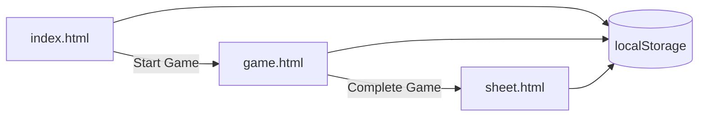

# How it works

## User flow

### 1. Roster setup (`index.html` + `js/roster-page.js`)

- Enter game details: home/away team, date, time, venue, competition.
- Add players per team: jersey number, name, role (skater / goalie).
- Limits: **22 skaters + 3 goalies** per team; jersey numbers unique within a team; roster sorted by number.
- **Start Game:** requires ≥1 skater per team. If a team has 2+ goalies, a modal picks the **starting goalie**.
- **New Game** clears `localStorage`.

### 2. Live game (`game.html` + `js/game.js`)

**Top bar (shared for all events):**

| Control | Purpose |
|---------|---------|
| Period | `1`, `2`, `3`, or `OT` |
| Time (MM:SS) | Minutes + seconds from arena clock |
| Clock | Counting **down** or **up** (affects sorting and cumulative time) |

**Action buttons (open modals):**

- `{Home Team} — Goal` / `{Home Team} — Pen`
- `{Away Team} — Goal` / `{Away Team} — Pen`
- **Log goalie swap** (link) — team + goalie coming in

Modals capture event-specific fields only; period and time come from the top bar.

**Event log:** chronological list with cumulative game time, edit, and delete.

### 3. Print sheet (`sheet.html` + `js/sheet.js` + `css/sheet.css`)

- Recreates the EIHA game sheet layout (home/away blocks + right sidebar).
- Calls `computeGameStats(state, { finalizePenalties: true })` and `computeNetminderStats(state)`.
- All displayed times use **cumulative game time** (20-minute periods).

---

## Module map

| File | Responsibility |
|------|----------------|
| `js/storage.js` | Load/save/clear `GameState`, `generateId()` |
| `js/roster.js` | Roster validation, limits, sorting helpers |
| `js/roster-page.js` | Setup page UI |
| `js/data/penalties.js` | Embedded penalty type list + duration constants |
| `js/data/goals.js` | Goal type labels (`E`, `SH`, `PPG`, `EN`) |
| `js/penalties.js` | PP logic, stats engine, time helpers, netminder stats |
| `js/game.js` | Live game UI, modals, event CRUD |
| `js/sheet.js` | Populate printable HTML from derived stats |
| `css/styles.css` | App UI (tablet-friendly) |
| `css/sheet.css` | A4 landscape print layout |

---

## Time handling

### Arena clock (stored on events)

Events store **period** + **period-relative time** (e.g. period `2`, time `1:10`).

### Cumulative game time (display on sheet & event log)

`toGameTime(period, time, clockDirection)` in `js/penalties.js`:

- Assumes **20-minute** regulation periods; OT is the 4th segment.
- **Counting up:** period time is elapsed time in the period.
- **Counting down:** period time is converted from time remaining.

Example: period 2, `1:10` elapsed → **`21:10`** game time.

### Penalty sheet columns

| Column | Meaning |
|--------|---------|
| Given | Cumulative game time when penalty was assessed |
| Start | Cumulative game time when penalty began serving (updates if a double-minor segment restarts) |
| End | When penalty ended (early on PP goal, or calculated expiry when sheet is finalized) |

---

## Penalty & power-play rules (`js/penalties.js`)

| Duration | PIM | Creates PP? | Ends early on opponent PP goal? |
|----------|-----|-------------|----------------------------------|
| `2` | 2 | Yes | Yes |
| `2+2` | 4 | Yes | First 2-min segment only |
| `5` | 5 | Yes | No |
| `10` | 10 | No | No |
| `2+10` | 12 | Partial | Minor portion only |
| Coincidental | per duration | No | N/A |

- **PP detection:** team with more active (non-coincidental, PP-eligible) penalties is shorthanded; opponent is on the PP.
- **Goal on PP:** terminates the shortest eligible opponent minor; goal type auto-suggested as `PPG` / `SH` / `E`.
- **Finalize on print:** open penalties get an **End** time = start game time + remaining minutes.

Events at the same timestamp are ordered: **penalty → goal → goalie_swap**.

---

## Netminder stats (`computeNetminderStats`)

Each **stint** (starting goalie or each swap-in) gets a row:

| Field | Meaning |
|-------|---------|
| Time On | `0:00` for starter; cumulative game time for swaps |
| Period columns 1–3, OT | Goals conceded **against that team** while this goalie was in net, in that period |
| Total | Sum of goals conceded during the stint |

Goals are attributed by replaying the timeline: whichever goalie was active when the opposing team scored.

---

## Derived vs stored data

**Stored in `GameState`:** rosters, settings, raw `events[]`.

**Computed at render** (never persisted): player G/A/PIM, period scores, PIM totals, penalty end times, netminder rows, active penalties.

Always mutate events then call `computeGameStats` / `computeNetminderStats` rather than storing totals.

---

## Out of scope (current version)

- Running arena clock
- Shots on goal
- Official signatures / attendance in-app
- Backend / multi-game database
- Auth
